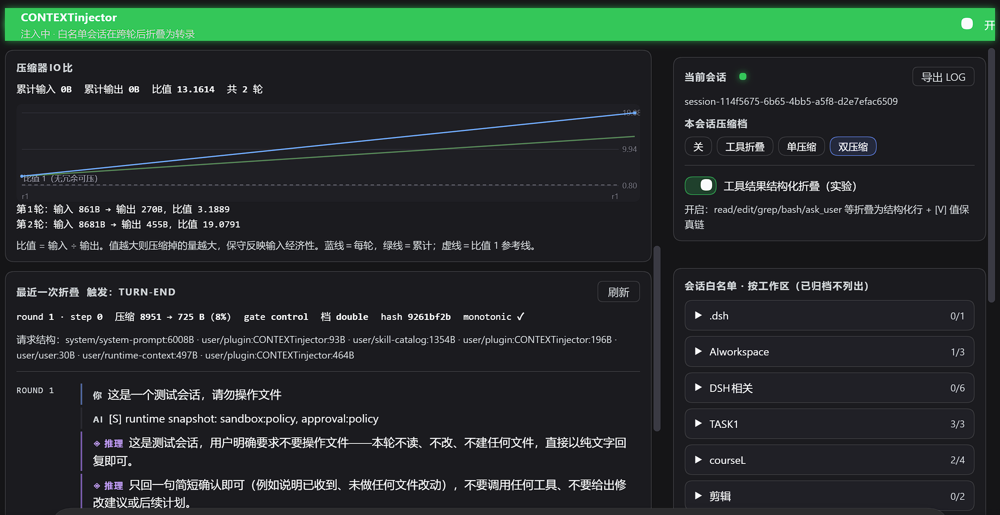
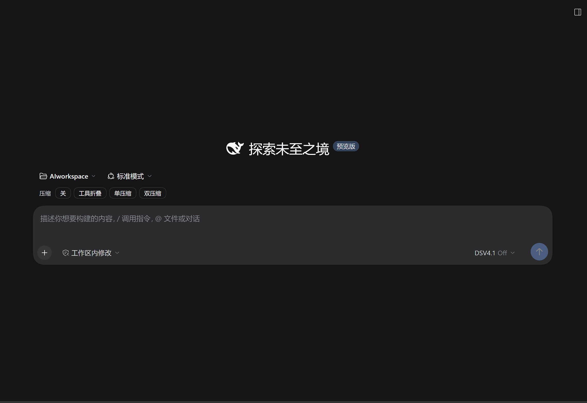
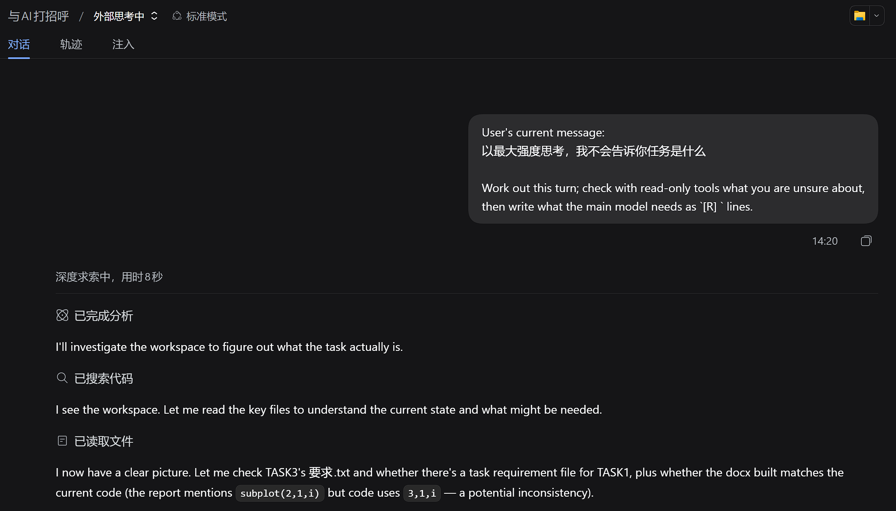
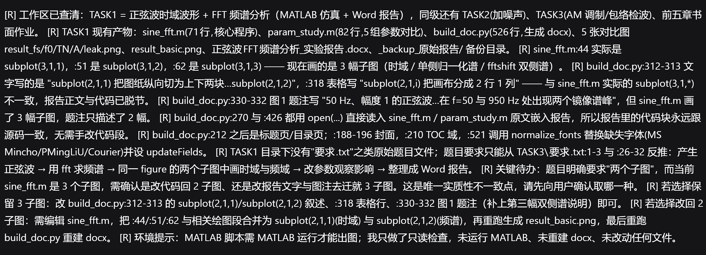
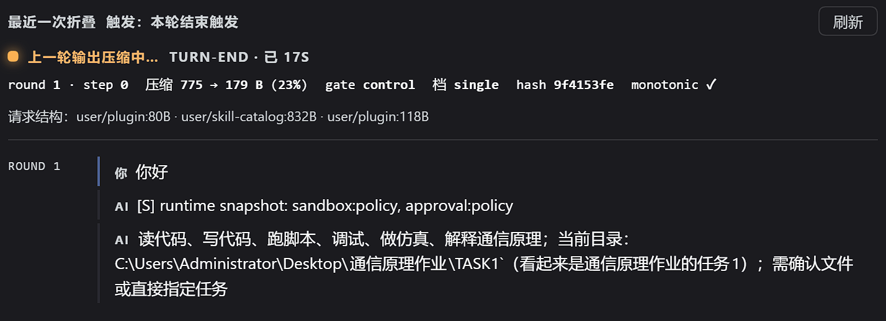

# StateCompiler — 直装包（EXTREASON 外置推理 + CONTEXTinjector + LOGcompiler + WebUI 面板）

> **把长对话的重复计费砍掉一半，再给模型配一名只读调查员：先核实，后动手。**

把 **EXTREASON（reasoning 外置）+ CONTEXTinjector（注入折叠）+ LOGcompiler（转录日志）+
contextinjector-webui（「注入」面板）** 一起直装进 DeepSeek Harness（DSH）的 **web profile**。
装好后在会话侧边找到「注入」tab 使用。

> 本包版本 / 来源提交 / 构建时间见同目录 **`version.json`**；本版改动与保留项见
> **`RCS-0.1.11-改进与保留项.txt`**（同目录）。

> **兼容性（dshTarget: 0.1.7-rc.2）**：插件含**双代兼容层**——同一份文件同时适配 `0.1.5-rc.2` 与 `0.1.7-rc.2` 两代宿主接口（消息来源标记 / 事件枚举 / 子代理接口三族差异均为双形态实现）。
> 已验证：`0.1.7-rc.2`（session-format v4 全链路，含折叠提交与审计）。
> 注意：新宿主的 `dsh_plugin_packages` 请求扩展与『改写历史』的折叠互斥，折叠档位需按 `RCS-0.1.21-改进与保留项.txt` 的 09-27 补录在 profile 层关闭该扩展（安装脚本已处理）。

## 目录
```
├── contextinjector.mjs         注入折叠插件（单文件）
├── logcompiler.mjs             转录日志插件（单文件）
├── extreason.mjs               外置推理插件（EXTREASON，单文件）
├── toolfold.mjs                工具结果折叠（被上面两个 import，须与 condense/ 同级）
├── condense/chunk.mjs,ivr.mjs  共享纯模块（转录分型 / 压缩器 IO 比）
├── contextinjector-webui/      WebUI 面板 npm 包（host /api + client 注入）
├── install.ps1 / install.cmd   直装（web profile）
├── uninstall.ps1               卸载/回滚
├── README.md                   本说明
├── LICENSE.txt                 MIT 开源许可证
├── version.json                产物来源/版本/提交/构建时间
└── RCS-0.1.11-改进与保留项.txt   本版改动、保留项、读数纪律
```

## 从零安装（终端，适用于 GitHub 克隆）

```bash
git clone https://github.com/ScreamingMaggot/rcs-context.git
cd rcs-context
powershell -ExecutionPolicy Bypass -File ./install.ps1
# 需指定目标时：-DSH_HOME <配置家目录>  -DshInstall <dsh 安装根>
```

安装脚本会：备份现网 → 落位插件与 WebUI 包 → 幂等追加 profile 补丁（四项挂载 + 一条按宿主探测的兼容项）→ 自校验。重复运行安全。
本仓库未发布 npm 包，故不使用 `dsh plugin add`；安装走上述脚本（或双击 `install.cmd`）。
**平台说明**：插件本体为跨平台 `.mjs`（随宿主运行）；安装/卸载脚本目前仅提供 Windows PowerShell 版本。

## 一键直装（Windows）
在**已运行/即将运行的 DSH 所在机器**上，双击 `install.cmd`，或：
```powershell
powershell -ExecutionPolicy Bypass -File .\install.ps1
# 默认装到 %DSH_HOME% 或 ~\.dsh 的 web profile；可显式指定：
.\install.ps1 -DSH_HOME "D:\path\to\.dsh" -DshInstall "D:\path\to\dsh-runtime"
```
脚本会：备份现网 → 落位插件与 WebUI 包 → 幂等追加 `cordis.patch.yml` 四项 insert → 自校验。重复运行安全。

## 装完必做
1. **重启 dsh web**（client 装载器按名缓存，必须重启才生效；刷新页面不够）。
2. 打开一个会话 → **「注入」tab**：
   - **CONTEXTinjector（默认关）**：右栏「当前会话」卡为本会话选「工具折叠 / 单压缩 / 双压缩」即启用折叠；
     - 工具折叠=对每轮对话做工具转录折叠（保留原始信息）
     - 单压缩=对每轮AI输出进行语义压缩
     - 双压缩=单次压缩基础上进行关键值保真提取
   - **LOGcompiler（默认全会话记录）**：日志写到 `$DSH_HOME/state-compiler/transcripts/<sid>.log`；
     在「日志编译」区可改输出目录/停用/逐会话开关。
3. 压缩通道（single/double 的浓缩调用）**默认跟随会话模型——不建议**：那会按主模型价格计费。
   请按下方『成本提示』把浓缩指向本地 Ollama 或任一廉价模型；压缩失败会无损回退，不会破坏档案。
4. **EXTREASON（外置推理，默认开）**：主模型 `reasoningEffort: off`（或模型无思维链能力）时，
   每轮自动跑一个只读子代理（UI 里显示为「外部思考中」）并把它的 `[R] ` 行注入当轮请求。
   不需要时设环境变量 `EXTREASON=0`。详见 `EXTREASON/README.md`。

## 界面截图（实拍）

**①「注入」面板**：左上为压缩比走势（蓝线=每轮、绿线=累计，虚线=比值 1 参考线），中间是本次折叠读数
（`8951 → 725 B`、8%、档位 `double`、单调性 ✓）与请求结构逐段字节，右侧是当前会话的档位与开关。



**② 会话输入区的档位选择器**（默认「关」；开启折叠后每一轮的下方即出现压缩读数）：



**③「外部思考中」**：主模型少想快跑的同时，只读调查员在当轮实际执行 分析 / 搜索代码 / 读取文件：



**④ 调查员简报（`[R]` 行）**：逐行标明文件与行号、指出唯一实质性不一致点并给出两个可选动作，末尾声明
「只做了只读检查、未运行、未改动任何文件」：



**⑤ 折叠进行中**：会话标签旁显示「压缩中」，面板给出触发点（TURN-END）、耗时与本轮读数
（`775 → 179 B`、23%、档位 `single`、单调性 ✓）：



> 截图取自真实长会话，未做美化；会话 ID 与本地路径为你自己的环境，若公开传播建议自行打码。

## 成本提示（重要）：压缩通道请走本地或廉价模型

**为什么**：`single` / `double` 档位会为每条被折叠的助手输出调用一次"压缩模型"（实测每局中位 20 / 42 次）。
若这条通道走主模型，等于用主模型的价格反复付压缩费——省钱的效果会被吃掉大半。
把压缩模型换成本地 Ollama 或任一低价模型，这部分开销接近于零，而**无损折叠的收益一分不少**（收益主要来自工具结果折叠，它不需要模型）。

**怎么配（两步）**

① 在 DSH 的 `~/.dsh/settings.yaml` 注册本地 Ollama（三个字段缺一不可，都是实测踩出来的）：

```yaml
llm-pi-ai:
  providers:
    ollama:
      displayName: Ollama (本地)
      api: openai-completions
      baseURL: http://127.0.0.1:11434/v1
      apiKeyEnv: OLLAMA_API_KEY          # 本地服务任意值即可，但字段必须在
      compat:
        maxTokensField: max_tokens       # 关键：ollama 只认 max_tokens，缺此字段输出上限失效
      streamIdleTimeoutMs: 30000         # 卡住 30s 即无损回退，不拖垮整轮
      models:
        - id: qwen3:4b-instruct-2507-q4_K_M
          name: Qwen3 4B (本地压缩器)
          reasoningEfforts:
            off: null
            medium: medium               # 显式声明：不写会被判为"不支持任何思考档"
```

② 把压缩通道指过去（三选一，优先级从高到低）：
- WebUI「注入」面板里为该会话选择压缩模型（最直观）；
- 会话的 `control.json` 写 `{"condenseProvider":"ollama","condenseModel":"qwen3:4b-instruct-2507-q4_K_M"}`；
- 环境变量 `DSH_CONTEXTINJECTOR_CONDENSE_PROVIDER` / `DSH_CONTEXTINJECTOR_CONDENSE_MODEL`。

**用弱模型的代价**：压缩率会低一些、单次更慢（4B 级一条约 7–15s），**但不会出错**——
压缩超预算或质量不达标时插件一律无损回退（原文照旧进转录），档案与可回放性不受影响。

**EXTREASON 不需要单独配**：它的子调查员每轮调用一次模型，但简报会让主模型少读历史——
实测计费中位反而更低（11.2 万 vs 不开的 14.0 万），故无需为它指定廉价模型。

## 权限边界与第三方网络依赖（如实声明）

- **写入范围**：仅 `$DSH_HOME`（web profile 目录、`state-compiler` 状态目录、转录日志、按需创建的 `raw/` 归档与折叠审计 `fold-index/`）。不写系统目录、不改 PATH、不改 shell 配置。
- **进程形态**：作为宿主进程内插件加载，不安装后台服务、不注册开机项。
- **插件自身不发起任何网络请求**。仅两处例外，且都必须由你显式配置后才发生：
  1. 把压缩通道指向本地/远程 Ollama（或任一 OpenAI 兼容端点）时，该请求由宿主的 LLM 适配器发出；
  2. EXTREASON 的子调查员使用**宿主已注册**的模型与只读检索工具（若启用了网页检索，则走宿主自身的检索通道）。
- **子会话权限**：EXTREASON 的子会话以只读工具集运行（读文件 / 检索），不具备写权限；产出以 `[R] ` 行注入。
- **凭据**：插件不读取、不存储模型凭据（由宿主凭据服务管理）。
- **卸载**：`uninstall.ps1` 回滚补丁项与文件（含安装时备份的还原）。

## 卸载
```powershell
.\uninstall.ps1                 # 还原安装前备份 / 移除补丁项与文件
```
删干净后再重启 web。

## A档实验：工具结果结构化折叠（0.2.0 起，默认关）
> 实验功能，默认 **OFF**，不影响既有行为。开启后，折叠历史里的工具结果会从 `[T] tool|path|OK`
> 升级为结构化短行 `[T] <域>|<action>|<target>|OK|P0–P3|<k=v>…` 并追加值保真链 `[V]`：
> read 保留 `size/sha8/lines`、edit/write 失败把 err 原文入 [V]、glob/grep 留 `pattern/count/matches≤K`、
> bash 留 `head/tail/tee`、**ask_user 答复 P3 逐字入 [V]**（不可重建）。
> 开启方法：装好后在会话「注入」tab → 右栏「当前会话」卡 → 先为本会话选一个压缩档
> （工具折叠/单压缩/双压缩，让它进入折叠），再打开下方 **「工具结果结构化折叠（实验）」** 开关。
> 纯规则、无 LLM；有 token 成本，仅在你开启的会话生效。若内测发现问题，把现象/转录反馈即可。

## 说明 / 数据位置
- 运行时配置与控制：`$DSH_HOME/state-compiler/`（`control.json`、`logcompiler.control.json`、`last-fold.json`、`transcripts/`、`.ctxinjector/raw/`）。
- 安装备份：`$DSH_HOME/.statecompiler-backup-<时间戳>/`（uninstall 用它回滚）。
- 源码与重建：见 StateCompiler 仓库 `build-dist.ps1`（从 git HEAD 可复现本目录；该脚本自带
  pre/post-flight：校验发布脚本 BOM、校验 `version.json` 版本号、对每个 `.mjs` 跑 `node --check`）。

## 发布前自检（仓库侧，可随时复跑）
```powershell
powershell -ExecutionPolicy Bypass -File StateCompiler\packaging\smoke-install.ps1
```
它在 `%TEMP%` 造一个假 DSH_HOME 真跑一遍 **安装 → 重复安装（幂等）→ 半装升级 → 卸载回滚**，
并核对本目录自洽（清单齐全、`version.json` 可解析且版本一致、`.ps1` 带 BOM、`.mjs` 不带 BOM、
发布说明是合法 UTF-8 中文、装出来的插件与 `dist` 逐字节一致）。全绿才发。

## 运行参数（`control.json`，多数热读、免重启）
| 键 | 缺省 | 作用 |
|---|---|---|
| `enabled` | `true` | 总开关 |
| `sessions` / `sessionModes` | `[]` / `{}` | 白名单会话及其压缩档（`off`/`single`/`double`/工具折叠）。**未列出的会话不折叠**（无全局默认档） |
| `keepInject` | **ON** | DSH 注入节点（runtime/policy 快照、skill 目录）永不被遮蔽 ⇒ 快照零补发 |
| `toolfoldStructured` | `true` | 工具结果结构化 `[T]`/`[V]` |
| `condenseProvider` / `condenseModel` | 跟随会话 | 指定浓缩模型（如本地 `ollama`） |
| `condenseMinBytes` | 240 | 单条 `[A]` 低于此字节不送浓缩（0 = 全送，注意小值会让折叠变慢：实测 15 曾导致 243s 一次折叠） |
| `condenseMaxTokens` | 700 | 单条浓缩输出上限 |
| `condenseBudgetMs` / `condenseMaxCallsPerFold` | 15000 / 12 | 一次折叠的硬预算（时间长/调用多即止损回退） |
| `foldJoinTimeoutMs` | 3000 | 下一轮发请求前等待后台折叠的上限；超时就先发请求，绝不拖住对话 |
| `segments` | **OFF** | 多段转录（head 独立成段零重复 + 各段独立留面）。真机已验证，默认关；开启前建议按 NOTES 的样本门槛评估 |
| `standalone` | **OFF** | 遗留开关（新段不带旧前缀）。其目的已被多段转录覆盖，暂不推荐单开 |

## 装好后怎么自查（不看日志也能判）
- **面板**：会话「注入」tab 显示最近一次折叠（模式/触发/字节/压缩比/`monotonic`）、面板「压缩中」在飞标记。
- **端点**：`GET /api/context-inject/status`（含 `lastFold`、`foldInflight`、`control`、`sessions`）。
- **文件**（都在 `$DSH_HOME/state-compiler/`）：
  - `.ctxinjector/fold-index/<sid>.jsonl` —— 每次折叠一行：`cumLines.before/after` 应相邻承接、`after` 等于转录行数；
  - `.ctxinjector/fold-errors/<sid>.jsonl` —— 拒折/异常账本（**空 = 健康**）；出现持续 `foldtext-drift` 表示表面转录与状态脱节、折叠会停摆；
  - `last-fold.json` —— 最近一次折叠详情（含 `full` 转录全文、`segments`、`afterNodes`）。
- **一键体检**（仓库侧，任意机器只读运行）：
  ```powershell
  node StateCompiler\CONTEXTinjector\tools\verify-fold-integrity.mjs --state <DSH_HOME>\state-compiler --all
  ```
  逐会话输出 PASS/WARN/FAIL：索引承接、`full` 段头链、拒折账本；可选 `--replay` 追加"表面段拼接 == full"校验。

## 什么时候开 single / double（实证口径，2026-09-12）

用 12 个真实工作场景 × 4 档（`bare` 基线 / `off` 无损工具折叠 / `single` / `double`）实测的结果：

| 档 | 机制级压缩率（字节加权） | 峰值上下文比（中位） | 峰值 ≥18K 时 |
|---|---|---|---|
| `off`（工具折叠） | **0.227**（压到约 1/4） | **0.931×** | **0.717×** |
| `single` | 0.209 | 1.049× | 0.843× |
| `double` | 0.210 | 0.991× | 0.742× |

- **无损工具折叠（`off`）在任何规模都稳赚**，且不调用任何模型（零 token、零延迟），是默认推荐档。
- **LLM 浓缩（`single`/`double`）只在长会话转正**：峰值 ≥18–20K token 才有净收益（0.72–0.84×）；
  10–25K 的常见中短任务上是 1.0–1.4×，即**净开销**（压缩省下的上下文盖不过调用与延迟）。
  ⇒ 建议：**日常用「工具折叠」；确认会长跑（峰值 ≥20K）的会话再选「单压缩/双压缩」**。
- 压缩收益**主要来自三者共有的无损工具折叠**；`[A]` 段浓缩是增益项而非主力。
- 判据看 `last-fold`：`aCount/aFolded`（命中率）、`fallbackReasons`（回退原因分型：`truncated`/`empty`/
  `noShrink`/`llmErr`/`payloadGate`/`maxCalls`/`budgetMs`/`keysErr`）、`keys`、`shrink`。
  注意 `ms` 会被机器休眠放大，不能当算力时间读。

## 已知取舍（如实说明）
1. **默认行为**：多段转录与 standalone 默认关闭 ⇒ 本包默认行为与 0.1.8 逐字一致。
2. **本地小模型慢**：4B 级浓缩一次 `[A]` 约 7~15s；一次折叠超预算就无损回退（转录照旧完整，只是没压缩）。
   判"有没有压缩"看 `calls`/`aFolded`；`ms` 可为 0，也会被机器休眠放大（实测有 4.7h 的读数）。
3. **无 `[R]` 的两种正常情形**：主模型 reasoning 未关（不做外置推理）；或该 preset 裁剪了工具集
   （此时账本记 `skip-no-readonly-tools`，不再报错）。
4. **装完必须重启 dsh web**：客户端插件按名缓存，刷新页面不够。
5. **本包基于 `@deepseek-ai/dsh 0.1.1-rc.2` 验证**；换 DSH 版本前请先核实。
